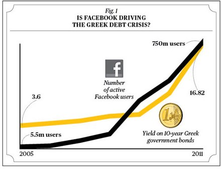

# Chapter 1: Introduction to InflxDb

* InfluxDb is a time series database
* Most commonly time series data is a sequence of measurements taken at successive equally spaced points in time
* Motivation for time series data analysis:
  * monitoring industrial processes
  * tracking corporate business metrics
  * measuring natural phenomenas, e.g.: heights of ocean tides
  * daily closing value of a stock exchange
* Applications of Time Series Analysis:
  * Economic Forecasting
  * Budgetary Analysis
  * Workload Projections
  * Inventory Studies
* Can also be used to draw erroneous conclusions:
